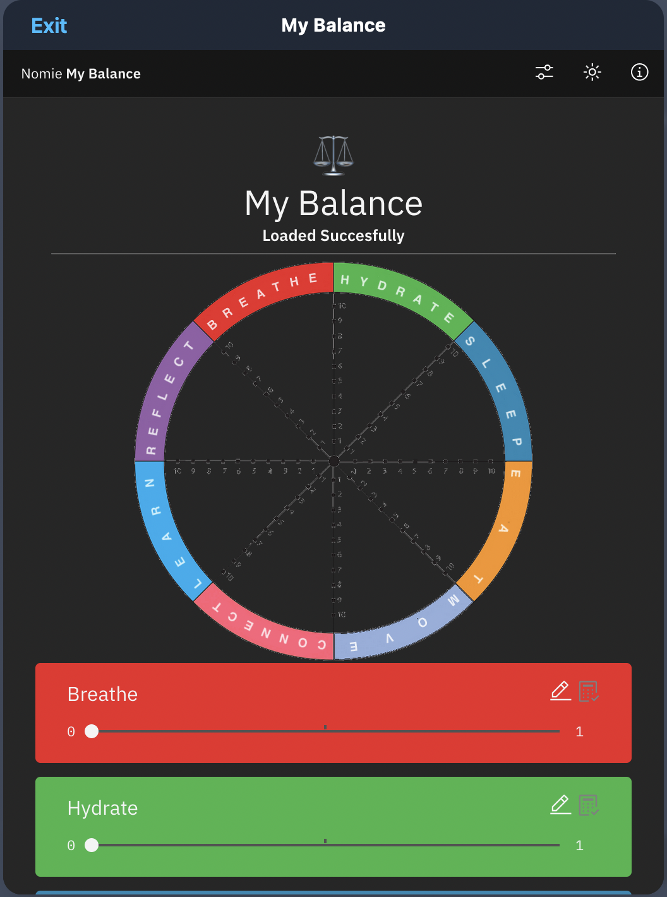

# ⚖️Nomie MyBalance Plugin

The ⚖️Nomie MyBalance Plugin is a plugin for Nomie6-oss.

## About the ⚖️Nomie MyBalance Plugin

The Nomie MyBalance Plugin enables you to identify areas which are important in your life and to track these areas manually or via a predefined calculation based on your Trackables. The idea is to give each of the areas a regular score between 0 and 1. Based on these scores you can follow each area individually, but even better, you can also track the balance between al the areas: My Balance.

## Installing the Plugin

The url of the plugin is:

[https://dailynomie.github.io/nomie-plugin-mybalance/](https://dailynomie.github.io/nomie-plugin-mybalance/)

The ⚖️Nomie MyBalance Plugin can be installed in Nomie via the following steps:

* Go to the More Tab
* Select Plugins
* Click the + or Add Custom Plugin
* Provide the url for the plugin
* Tap Install Plugin

## Using the Plugin

After launching the plugin, you will be presented with the main screen. It show the balance between the eight defined areas/catagories in a Wheel Of Life type of representation.

When you scroll down you will see the eight defined categories and a slider to provide input for each category on a scale between 0 and 1.

The easiest -and most simple- way of using the plugin is to adjust the scale via the slider on a regular (daily/weekly) interval.

### Calculated scores

Instead of manually set the score for each category, you can also choose to calculate the score based on a combination of Nomie trackables. This is best explained by an example. Let's asume you would like to track your hydration by using the three trackables (water, coffee, thee). Please click on the edit button on the Hydrate categoy and it will bring you to the calculation screen:

You can change the name of the category, but you can also start defining your calculation algorith.

Lets assume we want to define a hydration score where the amount of cups of milk and thee scores positive and the amount of cups of coffee negative. The amount of cups of thee are weighting twice as high as the amount of cups of milk.

Let's start by clicking the add Calculation button:

Now you can define your first parameter. Let's choose Thee. You can pick the Thee Trackable by clicking on the list symbol in the Trackable field. Remember that the peosn symbol let's you pick a person. The tag symbol let's you provide a free format search term.

After picking the Trackable, you start setting the parameters:

As you can see, we will get the data for the last 7 days and sum the amount of cups of Thee. A minimal score(0) will be given when the sum is 1 or lower. A maximum score (1) will be given when the sum is 7 or more.

We do not enable the reverse scale, as the more cups of Thee we drink, the better.

We give Thee a weight factor of 2 as we stated that we weight drinking Thee twice against drinking milk/coffee.

We are ready with the Thee Trackable. Let's also define coffee and milk.

Please pay attention that for coffy we enabled the reversed scale, meaning that the more cups we drink, the lower the score:

Now we save everything by clicking on the blue Save & Exit button.

You will return to the initial screen, but nothing changed yet. You have to enable calculation mode for this specific catagory by clicking on the auto-calculation button next to the edit button. Once you have enabled auto-calculation, the manual slider input will be disabed and your score will constantly being updated via the calculation algorith. In my example this gives the following result:

### Using the Widget

This plugin is also enabling an associated widget. You can enable this widget by adding a new widget to the Nomie Dashboard. You will see the MyBalance Plugin widget as option:

After adding the widget you will have the following widget on your dashboard. For all the categories for which you configured the auto-calculate option, the scores will be recalculated in the background and represented via the widget:

As always...have fun with this plugin!
